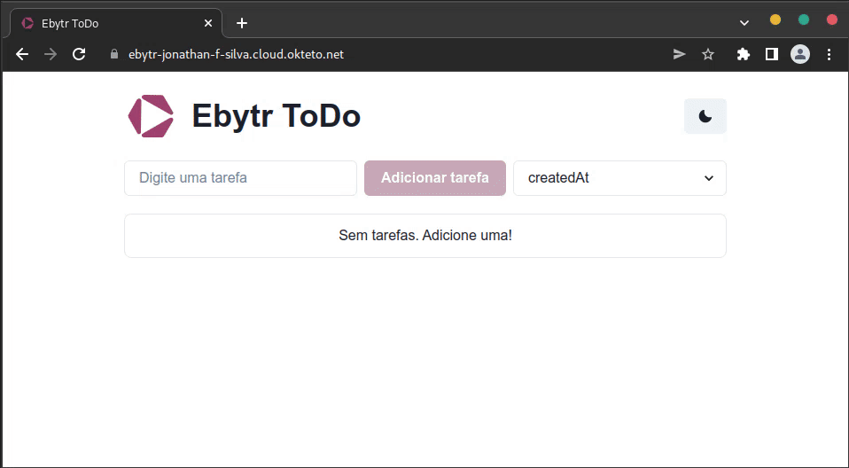

# Projeto Ebytr ToDo

<!--  -->

Aplicação estilo lista de tarefas em desenvolvimento para o Desafio da Blitz de Carreira da Trybe.

Com esse app é possível:
- Listar e ordenar tarefas pela descrição, data de criação e status
- Criar, editar e remover tarefas
- Alterar status de uma tarefa

## Demonstração



> Acesse o [deploy da aplicação aqui](https://project-eby001-prod-j0n4t-6lcuxg.mo1.mogenius.io)


## Aprendizados e Tecnologias

Nesse projeto aprendi muitas coisas e coloquei em prática muitas ferramentas e
conceitos bacanas que queria utilizar, aqui uma lista:

### API e DB
- Mongo, Node e Express
- Utilização das arquiteturas MSC e REST na API
- Utilização de conceitos de SOLID e Clean Code para a criação de classes na API

### UI
- Vite React com Context API
- Chakra UI para estilização dos componentes da UI

### Testes e Qualidade de código
- Husky para checagem de código pré-push
- Typescript para tipagem estática
- Eslint para consistência do código
- Testes unitários e de integração com Mocha, RTL, Chai e Sinon
- Mock de API para os testes de UI com MSW
- Code coverage com NYC
- Stryker para testes de mutação
- Testes com casos de uso usando escrita natural com Gherkin, Cucumber e Cypress
- [Plano de testes](docs/TESTING.md)

### DevOps
- Proxy reverso com NGINX
- Docker para conteinerização da aplicação
- CI com GitHub Actions para testagem de código ao criar Pull Requests e fazer push
- Deploy do Docker Compose usando a plataforma Okteto
- Deploy de containers individuais na plataforma Mogenius
- [Roadmap](docs/ROADMAP.md)


## Rodando localmente

É necessário ter [Docker](https://docs.docker.com/get-docker/) e [Node 16](https://nodejs.org/pt-br/) instalados na máquina.
Para desenvolvimento, é recomendado usar o [VSCode](https://code.visualstudio.com).

- Clone o repositório
```shell
git clone https://github.com/jonathan-f-silva/project-ebytr
```

- Entre da pasta e instale as dependências
```shell
cd project-ebytr
npm install
```

- Para iniciar
```shell
docker compose up -d
```

- Para iniciar em modo de desenvolvimento com hot reloading
```shell
docker compose up -f docker-compose.dev.yml -d
```


- Para abrir os testes E2E no Cypress
```shell
npm run cy:open
```

Caso tenha o Docker Compose instalado, é possível rodar o sistema usando
```shell
npm run compose:up
```
